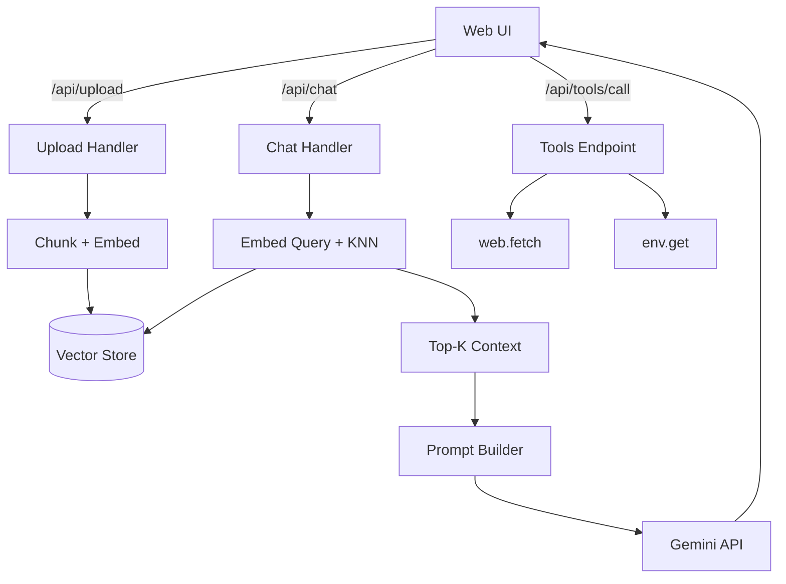

## Architecture

### Components
- `manage.py`: App entrypoint. Starts waitress (fallback to Flask dev server).
- `app/__init__.py`: App factory. Loads `.env`, prepares storage, registers routes.
- `app/routes.py`: HTTP endpoints for UI, chat, uploads, docs list, and tools.
- `app/rag/ingest.py`: File loading and text chunking.
- `app/rag/store.py`: Vector store with NearestNeighbors and disk persistence.
- `app/services/gemini_client.py`: Gemini client for embeddings and chat.
- `app/tools/mcp_tools.py`: Simple MCP-like tools.
- `app/templates/index.html`, `app/static/*`: UI.

### High-Level Diagram

### Data Storage
- `storage/documents/`: Uploaded files.
- `storage/vectors/index.npy`: Numpy array of embeddings.
- `storage/vectors/metadatas.json`: Chunk metadata and text for retrieval.

